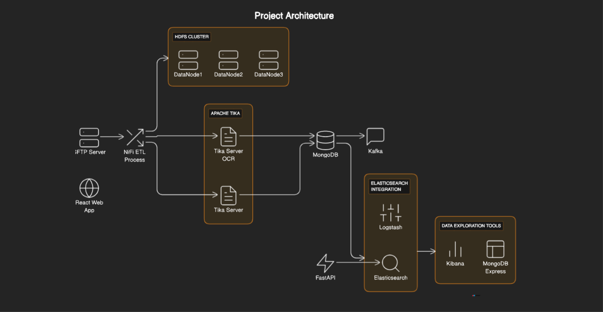

# Building a Powerful Document Search Engine: Leveraging HDFS, Apache Tika, SFTP, NiFi, Mongo, Elasticsearch, Logstash, Fast Api, React js

Our project is built on a foundation of critical components, each contributing to an efficient and robust data processing system. Here's an overview of the key elements:
## Project Reference
This project is based on the original project: [Document Search Engine ]([https://github.com/sergio11/document_search_engine/blob/master/README.md](https://github.com/sergio11/document_search_engine_architecture/tree/master)).

## 💾 HDFS Cluster
Our system incorporates a **3-datanode HDFS cluster**, specifically designed for the storage of original files awaiting processing. This arrangement guarantees both dependable data storage and easy access.

## 🔍 Apache Tika
Our solution leverages **two distinct Apache Tika servers** to streamline content extraction. One of these servers is enhanced with **OCR capabilities**, enabling us to extract text from images and scanned PDF documents, thus expanding our processing capabilities.

## 🚀 SFTP Server
The **SFTP Server** marks the beginning of our ETL process. It serves as the gateway where a microservice deposits files into a communal directory. These files are then consistently monitored and processed by a specialized **NiFi processor**.

## ⚙️ ETL Process
Central to our system is the **NiFi ETL process**. It efficiently transports files to the HDFS directory, determines their MIME type, and executes HTTP requests to the relevant Apache Tika server for the extraction of metadata and textual content. This extracted information is then preserved in a **MongoDB collection**, and updates on the process state are sent to **Kafka**.

## 🔎 Elasticsearch Integration
We employ a **Logstash pipeline** to synchronize our data with **Elasticsearch**, thereby augmenting our search capabilities. This integration is crucial as MongoDB does not inherently provide extensive search features.

## 📈 Data Exploration Tools
For the purpose of data exploration and visualization, we utilize **Kibana**. This tool offers an intuitive interface for the analysis and interpretation of indexed data.

## 🌐 Fast API Connection to Elasticsearch

## Execution Instructions

To efficiently manage and start the various components of our Document Search Engine Architecture, we use a Makefile with several commands. Here's how to use them:

- **Start Services**: To launch all services and display their URLs, run `make up`. This command starts services like Zookeeper, Kafka, Elasticsearch, and more, and provides their access URLs.

- **Change Permissions for SFTP**: If you need to modify permissions for the SFTP uploads directory, execute `make chmod-sftp`.

- **Execute Commands in Docker Container**: To run specific commands inside the Logstash Docker container, use `make exec-logstash`.

- **Run API**: For starting the Python app in the API directory, which includes installing dependencies, use `make run-api`. This will also display the documentation access URL.

- **Start Frontend Application**: To initiate the frontend application using Docker Compose, execute `make run-front`. This command will inform you about the URL where the frontend is accessible.

- **Clean Up**: To tear down all services and remove unused Docker images, run `make clean-all`. This command ensures that all containers, volumes, and images are appropriately removed.

Our system includes a **Fast API connection to Elasticsearch**, enabling robust and efficient search queries. This connection is fundamental in powering our advanced document search capabilities.

## React Web Application
Finally, a **React-based web application** offers a seamless user experience for searching and interacting with the data processed by our system.

Each component plays a crucial role in ensuring our data processing system is comprehensive, efficient, and user-friendly.
