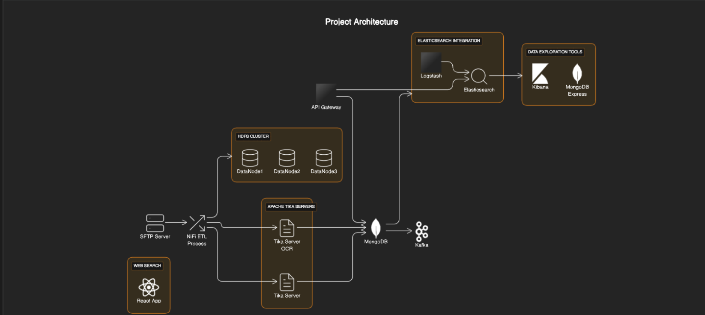

# Comprehensive Data Processing System: HDFS, Apache Tika, SFTP, NiFi, and More

Our project is built on a foundation of critical components, each contributing to an efficient and robust data processing system. Here's an overview of the key elements:

## 📂 HDFS Cluster
We've implemented a **3-datanode HDFS cluster** for storing original files that are ready for processing. This setup ensures reliable data storage and accessibility.

## 🌟 Apache Tika
Utilizing **two versions of Apache Tika servers**, our system is equipped to handle content extraction efficiently. One version includes **OCR capabilities** for extracting text from images and scanned PDFs, broadening our data processing scope.

## 📤 SFTP Server
Acting as the initial step in our ETL process, the **SFTP Server** is critical. It functions as the entry point where a microservice uploads files to a shared directory. A dedicated **NiFi processor** then continuously monitors and processes new files.

## 🔄 ETL Process
Our **NiFi ETL process** is a core component. It seamlessly moves files into the HDFS directory, identifies their MIME type, and makes HTTP requests to the appropriate Apache Tika server for metadata and text extraction. The extracted data is subsequently stored in a **MongoDB collection**, with process state updates relayed to **Kafka**.

## 🐘 Elasticsearch Integration
To enhance search capabilities, we sync data to **Elasticsearch** using a **Logstash pipeline**. This integration is vital as MongoDB alone doesn't support advanced search functions.

## 📊 Data Exploration Tools
For data visualization and exploration, we use **MongoDB Express** and **Kibana**. These tools provide a user-friendly interface for analyzing and interpreting indexed data.

## 🌉 API Gateway
Our system's integration is streamlined through an **API Gateway microservice**. This uses **Spring Cloud Gateway** to combine all APIs into a single, efficient point of entry.

## React Web Application
Finally, a **React-based web application** offers a seamless user experience for searching and interacting with the data processed by our system.

Each component plays a crucial role in ensuring our data processing system is comprehensive, efficient, and user-friendly.
